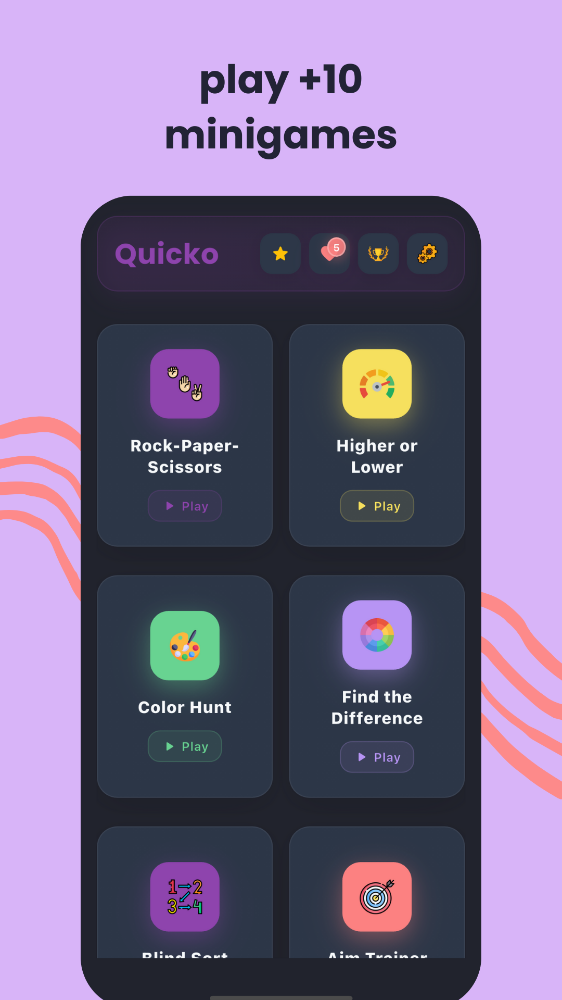
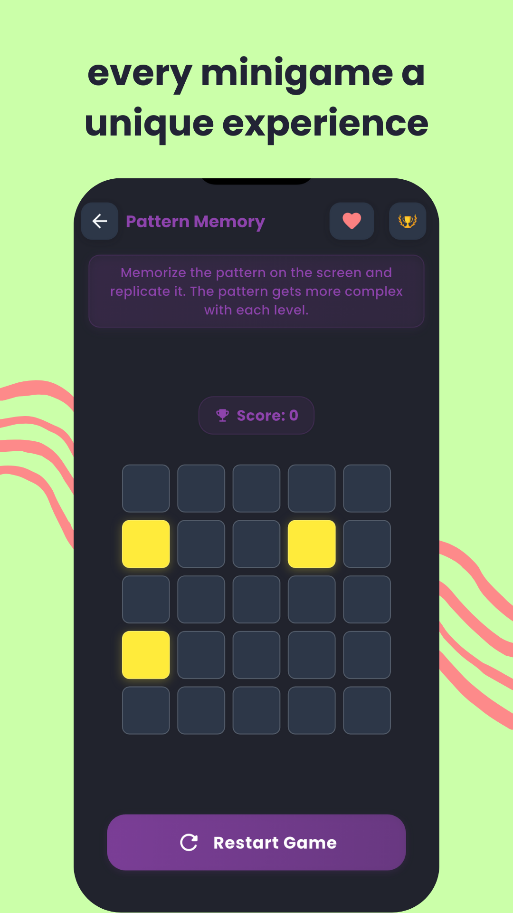
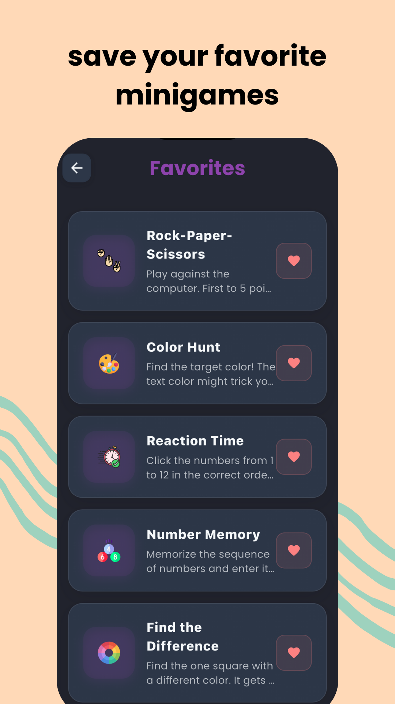
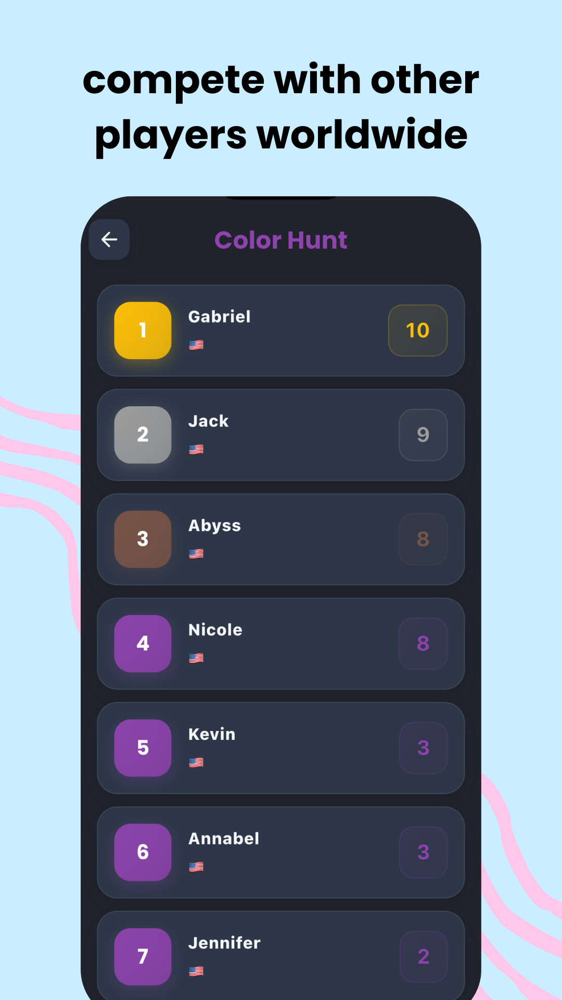
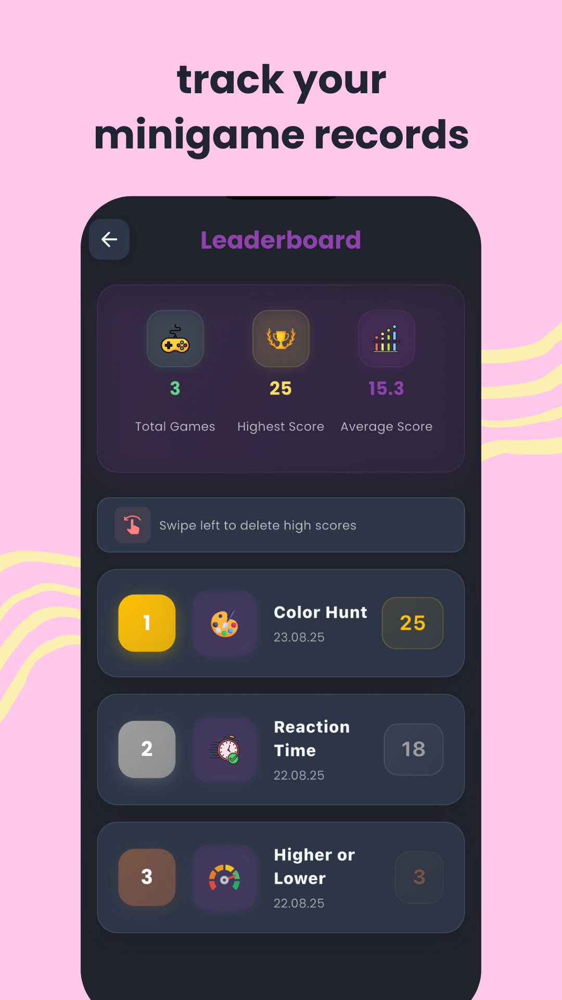
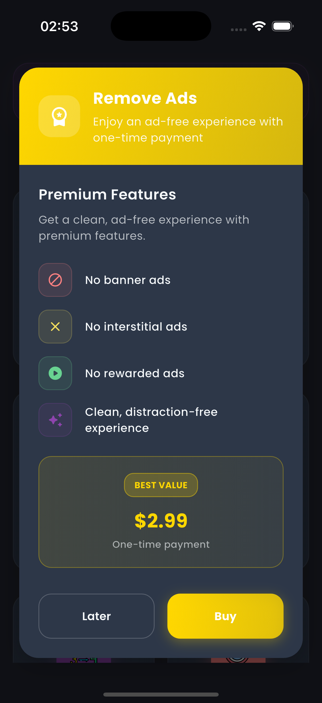
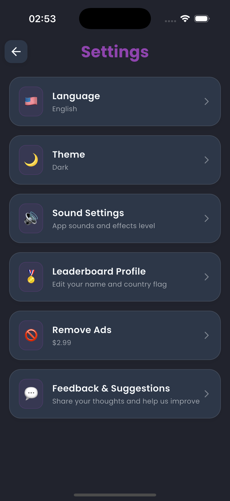

# Quicko Minigames

<div align="center">
  
  
  **A comprehensive brain training app featuring 10+ cognitive games**
  
  [](https://flutter.dev/)
  [](LICENSE)
  [](https://flutter.dev/)
</div>

## 📱 App Screenshots

<div align="center">
  <table>
    <tr>
      <td align="center">
        
        <br><strong>Home Screen</strong>
        <br>Ana ekran - Tüm oyunların listelendiği, favori oyunların öne çıkarıldığı ve oyuncunun istatistiklerinin gösterildiği merkezi hub.
      </td>
      <td align="center">
        
        <br><strong>Game Detail</strong>
        <br>Oyun detay sayfası - Seçilen oyunun kurallarının açıklandığı, yüksek skorların gösterildiği ve oyuna başlama butonunun bulunduğu sayfa.
      </td>
    </tr>
    <tr>
      <td align="center">
        
        <br><strong>Favorites</strong>
        <br>Favoriler sayfası - Kullanıcının favori olarak işaretlediği oyunların listelendiği, hızlı erişim sağlayan özel sayfa.
      </td>
      <td align="center">
        
        <br><strong>Global Leaderboard</strong>
        <br>Küresel liderlik tablosu - Tüm oyuncuların en yüksek skorlarının gösterildiği, dünya çapında rekabetin yaşandığı sayfa.
      </td>
    </tr>
    <tr>
      <td align="center">
        
        <br><strong>Personal Leaderboard</strong>
        <br>Kişisel liderlik tablosu - Kullanıcının kendi en iyi skorlarının ve gelişiminin takip edildiği, ilerleme grafiklerinin bulunduğu sayfa.
      </td>
      <td align="center">
        
        <br><strong>Premium Subscription</strong>
        <br>Premium abonelik sayfası - Reklamsız deneyim, ek özellikler ve premium içerikler için abonelik seçeneklerinin sunulduğu sayfa.
      </td>
    </tr>
    <tr>
      <td align="center">
        
        <br><strong>Settings</strong>
        <br>Ayarlar sayfası - Dil seçimi, tema değiştirme, ses ayarları, bildirim tercihleri ve diğer uygulama ayarlarının yapıldığı sayfa.
      </td>
    </tr>
  </table>
</div>

## 🎮 Game Collection

- **Find the Difference** - Spot the different colored square
- **Blind Sort** - Sort numbers without seeing the full sequence
- **Aim Trainer** - Hit targets as they appear randomly
- **Color Hunt** - Enhance visual perception and color recognition
- **Higher or Lower** - Train probability and decision-making
- **Number Memory** - Boost working memory and concentration
- **Pattern Memory** - Strengthen visual memory and pattern recognition
- **Reaction Time** - Measure and improve response speed
- **Rock Paper Scissors** - Classic game with AI opponent
- **Twenty One** - Strategic number game (Blackjack variant)

### ✨ Key Features

- **🎯 12+ Brain Training Games** - Diverse cognitive challenges
- **📊 Progress Tracking** - Monitor your improvement over time
- **🏆 Leaderboards** - Compete with other players globally
- **⭐ Favorites System** - Save and quick-access your preferred games
- **🌍 Multi-Language Support** - Available in 11 languages
- **🎨 Dark/Light Theme** - Customizable appearance
- **🔊 Sound Effects** - Immersive audio experience
- **📱 Cross-Platform** - Works on iOS and Android
- **📈 Achievement System** - Unlock achievements as you progress
-
## 🛠️ Technology Stack

- **Framework**: Flutter 3.7.0+
- **Language**: Dart 3.0.0+
- **State Management**: Provider
- **Localization**: Flutter Localizations
- **Ads**: Google AdMob
- **Analytics**: Firebase Analytics
- **Crash Reporting**: Firebase Crashlytics
- **In-App Purchases**: Flutter In-App Purchase
- **Audio**: AudioPlayers
- **Image Sharing**: Screenshot + Share Plus
- **HTTP**: HTTP Package
- **URL Handling**: URL Launcher

## 🌍 Localization

Quicko supports 11 languages:

- 🇺🇸 English
- 🇹🇷 Turkish
- 🇩🇪 German
- 🇪🇸 Spanish
- 🇫🇷 French
- 🇮🇹 Italian
- 🇧🇷 Portuguese (Brazil)
- 🇸🇦 Arabic
- 🇮🇳 Hindi
- 🇮🇩 Indonesian
- 🇷🇺 Russian

## 📊 Performance

- **App Size**: ~15MB (APK)
- **Memory Usage**: ~50MB average
- **Startup Time**: <2 seconds
- **Frame Rate**: 60 FPS consistently

## 📄 License

This project is licensed under the MIT License - see the [LICENSE](LICENSE) file for details.

### Copyright Notice

```
Copyright (c) 2025 Furkan Caglar

Permission is hereby granted, free of charge, to any person obtaining a copy
of this software and associated documentation files (the "Software"), to deal
in the Software without restriction, including without limitation the rights
to use, copy, modify, merge, publish, distribute, sublicense, and/or sell
copies of the Software, and to permit persons to whom the Software is
furnished to do so, subject to the following conditions:

The above copyright notice and this permission notice shall be included in all
copies or substantial portions of the Software.

THE SOFTWARE IS PROVIDED "AS IS", WITHOUT WARRANTY OF ANY KIND, EXPRESS OR
IMPLIED, INCLUDING BUT NOT LIMITED TO THE WARRANTIES OF MERCHANTABILITY,
FITNESS FOR A PARTICULAR PURPOSE AND NONINFRINGEMENT. IN NO EVENT SHALL THE
AUTHORS OR COPYRIGHT HOLDERS BE LIABLE FOR ANY CLAIM, DAMAGES OR OTHER
LIABILITY, WHETHER IN AN ACTION OF CONTRACT, TORT OR OTHERWISE, ARISING FROM,
OUT OF OR IN CONNECTION WITH THE SOFTWARE OR THE USE OR OTHER DEALINGS IN THE
SOFTWARE.
```

## 📞 Contact

- **Developer**: Furkan Caglar
- **Email**: quickogamehelp@gmail.com

## 📈 Roadmap

- [ ] Additional brain training games
- [ ] Social features and multiplayer
- [ ] Advanced analytics and insights
- [ ] Customizable difficulty levels
- [ ] Offline leaderboards
- [ ] Achievement sharing
- [ ] Daily challenges
- [ ] Progress export/import

---

<div align="center">
  <p>Made with ❤️ by <a href="https://github.com/furkanages">Furkan Caglar</a></p>
  <p>⭐ Star this repository if you find it helpful!</p>
</div>
